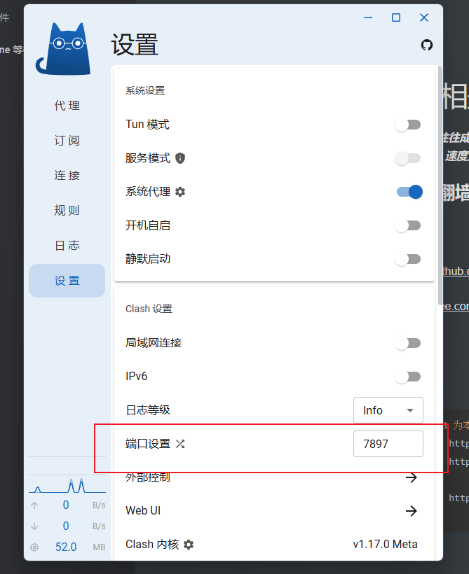

# jc-git clone  等相关问题

 ***在执行 git clone 时网速往往成为一大痛点，不论是否翻墙，撑死只有 200 kb 每秒，而关于提速的方法，网上众说纷纭，但大都没什么大用，使用下面我的方法，可以让你的 git clone 速度直接达到 2MB 每秒，无论是克隆什么仓库，都不再头大***

******

## **本次教程仓库地址**

> gitee：https://gitee.com/logimeteor/jcForGitClone.git
>
> github：https://github.com/Logimeteor/jcOfGitClone.git

****

## 前提，使用我的翻墙教程实现翻墙操作

教程网址如下：

> github：https://github.com/Logimeteor/packageOfClash.git
>
> gitee：https://gitee.com/logimeteor/package-of-clash.git

****

## 配置  git 代理

```sh
# 必须操作（127.0.0.1 为本地回环地址，简单来说，这个 ip 指代本机，后面的 7897 为端口号，这里参考 clash 中的配置）
git config --global http.proxy 127.0.0.1:7897
git config --global https.proxy 127.0.0.1:7897
# 不是必须操作
git config --global http.timeout 300          # 设置 HTTP 超时为 300 秒（5 分钟）

```

具体端口号参考下面内容：



**验证是否配置成功**

```sh
git config --list # 结果如果出现 http.proxy=127.0.0.1:7897 等前面配置的内容则代表成功，如果没有，重新执行上面命令
```

**使用 git clone 操作验证速度 **

```sh
git clone https://github.com/LecterChu/nwpu-cram.git
```


****

# 其他问题，例如从国外某网站下载内容到文件，的速度加快方法

## 前提同上，需要按照教程实现翻墙

****

## 示例：realsense 中 realsense-ros 的源码编译安装

- Create a ROS2 workspace

  ```sh
  mkdir -p ~/ros2_ws/src
  cd ~/ros2_ws/src/
  ```

  

- Clone the latest ROS Wrapper for Intel® RealSense™ cameras from [here](https://github.com/IntelRealSense/realsense-ros.git) into '~/ros2_ws/src/'

  ```sh
  git clone https://github.com/IntelRealSense/realsense-ros.git -b ros2-master
  cd ~/ros2_ws
  ```

  

- Install dependencies

```sh
sudo apt-get install python3-rosdep -y
sudo rosdep init # "sudo rosdep init --include-eol-distros" for Foxy and earlier
rosdep update # "sudo rosdep update --include-eol-distros" for Foxy and earlier

```

**这里一般都执行无法通过，主要问题出在  rosdep update 上，因为该命令需要按照前一条命令中得到的链接去下载内容，而下载这些外网网页内容非常慢，最终导致无法下载报错**


## ubuntu 执行命令

```sh
export https_proxy=http://127.0.0.1:7897 http_proxy=http://127.0.0.1:7897  # 替换为你的代理端口
```

再执行命令

```sh
rosdep update
```

会发现速度显著提高，一路顺畅无阻，最终没有报错执行完毕

